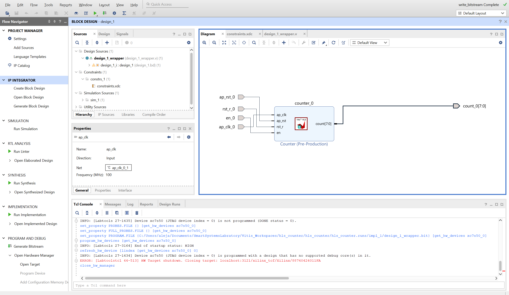

# HLS Adder
## Learn the basics of HLS by creating a simple counter

A complete tutorial for creating a simple counter using Vitis HLS and integrating it into a Vivado block design for the Urbana FPGA board.
 
---
## PRE-REQ: HLS_1_ADDER

## Required Software

**AMD Xilinx Vitis 2024.1 – Complete Suite**

Includes:
- Vivado Design Suite
- Vitis HLS
- Vitis IDE

⚠️ Make sure you install the complete suite, not individual tools.

---

## Optional Hardware

- Urbana FPGA Board

---

## Recommended Background

- Basic proficiency in C/C++
- Basic understanding of digital logic

---

# Simple HLS Counter Tutorial

---

## Step 1: Launch Vitis

1. Open Vitis 2024.1
2. ⚠️ **Make sure you open Vitis, not Vitis HLS 2024.1.**


You should see the following home screen.


---

## Step 2: Create a Workspace

1. Click **Open Workspace**.
2. Navigate to your preferred directory and create a folder called: `hls_counter`
3. Select the folder and click **Open Folder**.


---

## Step 3: Create an HLS Component

1. In the top-left corner, select **Create HLS Component**.
2. A setup window will appear:
   - Change the component name to `simple_counter`
   - Keep the component location unchanged


3. On the **Configuration File** page, do not change anything. Click **Next**.
4. On the **Source Files** page, do not change anything. Click **Next**.
5. On the **Hardware** page:
   - Search for `xc7s50csg324-1`
   - Select it and click **Next**


6. Leave the remaining settings as-is and click **Finish**.

You should now see the following screen but with the component called simple_counter.


---

## Step 4: Add Source and Testbench Files

In the top-right panel under `simple_counter [HLS]`:

1. Right-click **Sources** → **Add Source File**
2. Create a new C++ file named: `simple_counter.cpp`
3. Repeat the process for the testbench:
   - Right-click **Testbench** → **Add Test Bench File**
   - Name it: `simple_counter_tb.cpp`


---

## Step 5: Add the HLS Code

Copy the following into `simple_counter.cpp`:

```cpp
#include <ap_int.h>

extern "C" void counter(
    bool rst,
    bool en,
    ap_uint<8> &count
) {
#pragma HLS INTERFACE ap_none port=rst
#pragma HLS INTERFACE ap_none port=en
#pragma HLS INTERFACE ap_none port=count
#pragma HLS INTERFACE ap_ctrl_none port=return

    static ap_uint<8> reg = 0;

    if (rst) {
        reg = 0;
    } else if (en) {
        reg = reg + 1;
    }

    count = reg;
}

```

Now copy the following into `simple_counter_tb.cpp`:

```cpp
#include <iostream>
#include <ap_int.h>

extern "C" void counter(bool rst, bool en, ap_uint<8> &count);

int main() {
    ap_uint<8> c;

    // Reset
    counter(1, 0, c);
    if (c != 0) return 1;

    // Enable counting
    for (int i = 1; i <= 5; i++) {
        counter(0, 1, c);
        if (c != i) return 1;
    }

    // Hold value when disabled
    counter(0, 0, c);
    if (c != 5) return 1;

    // Reset again
    counter(1, 0, c);
    if (c != 0) return 1;

    std::cout << "SIM PASSED\n";
    return 0;
}

```

---

## Step 6: Run C Simulation

1. In the bottom-right corner under **C SIMULATION**, select **Run**.
2. If prompted to enable the Code Analyzer, select **No thanks**.
3. After simulation completes, a terminal window should appear.
4. If everything is correct, it should print: `SIM PASSED`


---

## Step 7: Set the Top-Level Function

Before synthesis, we must define the top-level function.

In the top-left panel under `simple_counter [HLS]`:

1. Select **Settings**
2. Open `hls_config.cfg`
3. Search for **Top**.
4. Under **C Synthesis Sources**, click **Browse** and select: `simple_counter.cpp`


5. Click **OK**.

---

## Step 8: Run HLS Flow

Run the following steps in order:

1. Under **C Synthesis**, select **Run**
   - Terminal should end with: "Synthesis finished successfully"


2. Under **C/RTL Co-Simulation**, select **Run**
   - Output should say: "Co-simulation finished successfully"

3. Under **Package**, select **Run**
   - Output should say: "Package finished successfully"

4. Under **Implementation**, select **Run**
   - Ignore warnings
   - This may take a while
   - Output should say: "Implementation finished successfully"

---

# Vivado Integration

---

## Step 9: Create a Vivado Project

1. Open Vivado 2024.1.
2. On the home screen under **Quick Start**, select **Create Project**.
3. Project name: `hls_counter_tutorial`
4. Choose a project location
5. Project type: **RTL Project**
6. Skip **Add Sources** and **Add Constraints**
7. On the **Default Part** page, search for: `xc7s50csga324-1`


8. Click **Finish**.

---

## Step 10: Create Block Design

1. In the left panel, select **Create Block Design**.
2. When prompted, press **OK**.


---

## Step 11: Add HLS IP Repository

From the top menu:

1. Select **Tools** → **Settings**


In the settings window:

2. Expand **IP**
3. Select **Repository**


4. Click the **+** icon and navigate to your Vitis HLS project directory.
5. Select the folder named `ip` (see screenshot). It should be similar to the folder for the hls adder shown below.


6. Press **OK**, then **Apply**.

---

## Step 12: Add the Adder IP

Back in the block design:

1. Click the **+** icon in the diagram area


2. Search for **Counter** and add it.
3. Right-click the IP block and select **Make External** to expose its inputs and outputs.

---

## Step 13: Create HDL Wrapper

In **Sources** → **Design Sources**:

1. Right-click `design_1`
2. Select **Create HDL Wrapper**
3. Choose **Let Vivado manage wrapper and auto-update**



4. Click **OK**.

---

## Step 14: Add Constraints

1. Right-click **Constraints** → **Add Sources**


2. Select **Add or Create Constraints**
3. Choose **Create File**
4. Name it: `urbana`
5. Click **Finish**
6. Open the newly created constraint file and paste the following:

```tcl
############################################################
# RealDigital Urbana - HLS Counter
# SW0 -> ap_clk_0   (NOT A REAL CLOCK - DEMO ONLY)
# SW1 -> en_0
# SW2 -> ap_rst_0
# SW3 -> rst_r_0
# LED[7:0] <- count_0[7:0]
############################################################

############################
# Switches
############################
set_property -dict {PACKAGE_PIN G1 IOSTANDARD LVCMOS25} [get_ports ap_clk_0]   ;# SW0
set_property -dict {PACKAGE_PIN F2 IOSTANDARD LVCMOS25} [get_ports en_0]       ;# SW1
set_property -dict {PACKAGE_PIN F1 IOSTANDARD LVCMOS25} [get_ports ap_rst_0]   ;# SW2
set_property -dict {PACKAGE_PIN E2 IOSTANDARD LVCMOS25} [get_ports rst_r_0]    ;# SW3

############################
# LEDs (count[7:0])
############################
set_property -dict {PACKAGE_PIN C13 IOSTANDARD LVCMOS33} [get_ports {count_0[0]}]
set_property -dict {PACKAGE_PIN C14 IOSTANDARD LVCMOS33} [get_ports {count_0[1]}]
set_property -dict {PACKAGE_PIN D14 IOSTANDARD LVCMOS33} [get_ports {count_0[2]}]
set_property -dict {PACKAGE_PIN D15 IOSTANDARD LVCMOS33} [get_ports {count_0[3]}]
set_property -dict {PACKAGE_PIN D16 IOSTANDARD LVCMOS33} [get_ports {count_0[4]}]
set_property -dict {PACKAGE_PIN E13 IOSTANDARD LVCMOS33} [get_ports {count_0[5]}]
set_property -dict {PACKAGE_PIN E14 IOSTANDARD LVCMOS33} [get_ports {count_0[6]}]
set_property -dict {PACKAGE_PIN F13 IOSTANDARD LVCMOS33} [get_ports {count_0[7]}]

############################
# Board configuration
############################
set_property CFGBVS VCCO [current_design]
set_property CONFIG_VOLTAGE 3.3 [current_design]
set_property BITSTREAM.CONFIG.UNUSEDPIN PULLUP [current_design]

```

---

## Step 15: Build and Program

In the left panel:

1. Select **Run Synthesis**


When synthesis completes:

2. Select **Run Implementation**
3. Then select **Generate Bitstream**
4. Once complete:
   - Ensure the Urbana board is plugged in
   - Select **Open Hardware Manager**


5. Click **Open Target** → **Auto Connect**


6. Finally:
   - Select **Program Device**
   - Click **Program**

---

## Done!

You can now test your counter using:
- Switches as inputs
- LEDs as outputs

---

