# AXI-Stream Image Inverter on Zybo Z7
## Vivado + Vitis + DMA + Python End-to-End Tutorial

A complete hardware-software tutorial for implementing a custom AXI-Stream IP core that inverts images using the Zybo Z7 FPGA board, DMA, and Python.

---

## Required Software

**AMD Xilinx Vitis 2024.1 – Complete Suite**

Includes:
- Vivado Design Suite
- Vitis IDE

⚠️ Make sure you install the complete suite, not individual tools.

---

## Optional Hardware

- Zybo Z7 FPGA Board (Z7-10 or Z7-20)

---

## Recommended Background

- Basic proficiency in C/C++
- Basic understanding of digital logic

---

# Part 1: Designing Custom AXI-Stream IP (Image Inversion)

---

## Step 1: Create a Vivado Project

1. Launch Vivado  
2. Select **Create Project**  
3. Click **Next**  
4. Name the project `inverter_demo`  
5. Choose a project location  
6. Click **Next**  
7. Select **RTL Project**  
8. Click **Next**  
9. On **Add Sources**, click **Next**  
10. On **Add Constraints**, click **Next**  
11. You should now be on the **Default Part** page  
12. Switch from **Parts** to **Boards**  
13. Search for **Zybo Z7-10** (or your board)  
14. If the board is not installed, install the board files  
15. Select the board  
16. Click **Next**  
17. Click **Finish**

You are now inside the Vivado project.

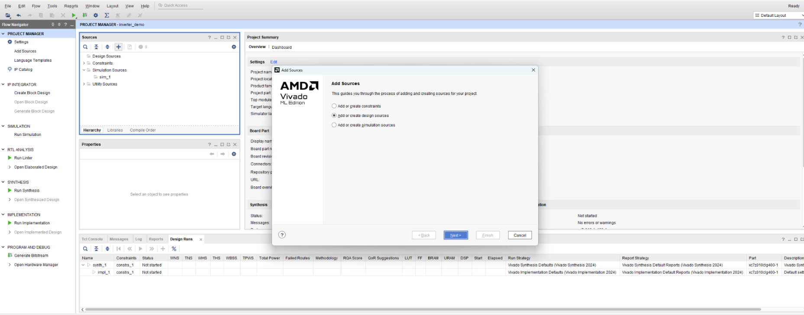

---

## Step 2: Add RTL Source File

1. In the **Sources** tab, click the **+** button  
2. Select **Add or Create Design Sources**  
3. Click **Next**  
4. Select **Create File**  
5. File type: **Verilog**  
6. File name: `inverter`  
7. Click **OK**  
8. Click **Finish**  
9. A **Define Module** popup will appear  
10. Click **OK**  
11. Click **Yes**

Now:
- Expand **Design Sources**
- Double-click `inverter.v`
- Paste the following RTL code:

```verilog
`timescale 1ns / 1ps
//////////////////////////////////////////////////////////////////////////////////
// AXI4-Stream Inverter with TLAST
//////////////////////////////////////////////////////////////////////////////////

module inverter #(
    parameter DATA_WIDTH = 32
)(
    input  wire                     axi_clk,
    input  wire                     axi_reset_n,

    // AXI4-Stream Slave Interface
    input  wire                     s_axis_valid,
    input  wire [DATA_WIDTH-1:0]    s_axis_data,
    input  wire                     s_axis_tlast,
    output wire                     s_axis_ready,

    // AXI4-Stream Master Interface
    output reg                      m_axis_valid,
    output reg  [DATA_WIDTH-1:0]    m_axis_data,
    output reg                      m_axis_tlast,
    input  wire                     m_axis_ready
);

    integer i;

    assign s_axis_ready = m_axis_ready;

    always @(posedge axi_clk) begin
        if (!axi_reset_n) begin
            m_axis_valid <= 1'b0;
            m_axis_data  <= {DATA_WIDTH{1'b0}};
            m_axis_tlast <= 1'b0;
        end else if (s_axis_valid && s_axis_ready) begin
            for (i = 0; i < DATA_WIDTH/8; i = i + 1)
                m_axis_data[i*8 +: 8] <= 8'hFF - s_axis_data[i*8 +: 8];

            m_axis_valid <= 1'b1;
            m_axis_tlast <= s_axis_tlast;
        end else if (m_axis_valid && m_axis_ready) begin
            m_axis_valid <= 1'b0;
            m_axis_tlast <= 1'b0;
        end
    end
endmodule
```

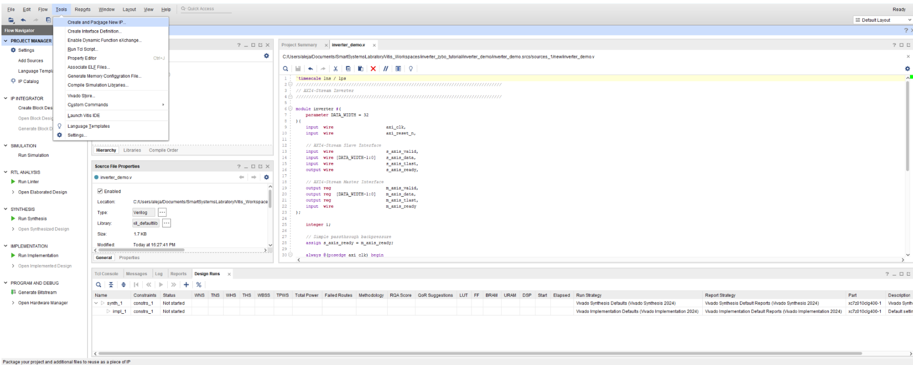

---

## Step 3: Package the RTL as an IP

1. In the top menu, select **Tools → Create and Package New IP**
2. Click **Next**
3. Select **Package the current project**
4. Click **Next**
5. Choose a directory where the IP will be saved
6. Click **Next**
7. Click **OK**
8. Click **Finish**

A new Package IP tab will open. In the Sources tab, you should now see `component.xml` inside an IP-XACT folder.

---

## Step 4: Define AXI-Stream Interfaces

### Master AXI-Stream Interface

1. In the Package IP view, select **Ports and Interfaces**
2. Click the **+** button
3. The Add Interface popup appears
4. Click the three dots next to **Interface Definition**
5. Select **axis_rtl**
6. Set:
   - Name: `m_axis`
   - Mode: `Master`
7. Click **OK**

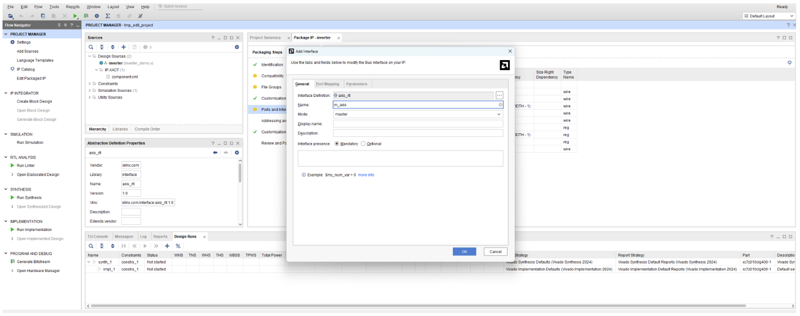

Now configure Port Mapping:
- Select `TDATA` under logical ports
- Select `m_axis_data` under physical ports
- Click **Map Ports**

Repeat for:
- `TLAST` → `m_axis_tlast`
- `TVALID` → `m_axis_valid`
- `TREADY` → `m_axis_ready`

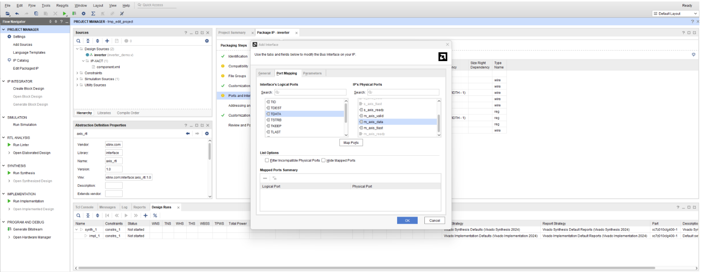

### Slave AXI-Stream Interface

1. Click the **+** button again
2. Interface Definition: `axis_rtl`
3. Name: `s_axis`
4. Mode: `Slave`
5. Click **OK**

In Port Mapping, connect:
- `TDATA` → `s_axis_data`
- `TLAST` → `s_axis_tlast`
- `TVALID` → `s_axis_valid`
- `TREADY` → `s_axis_ready`

6. Click **OK**

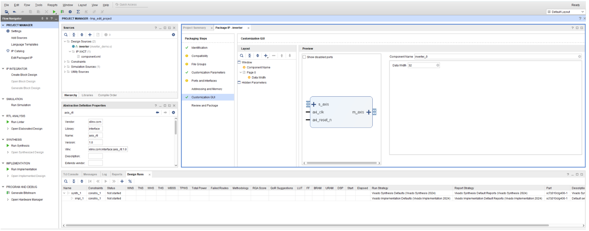

---

## Step 5: Clock and Reset Setup

1. Go back to **Ports and Interfaces**
2. Expand **Clock and Reset Signals**
3. Double-click `axi_clk`

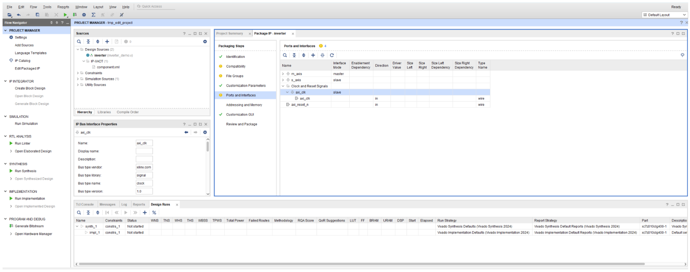

4. In the **Parameters** tab:
   - Click **+**
   - Name: `FREQ_HZ`
   - Move it into the User Set folder
   - Set value to `50000000`

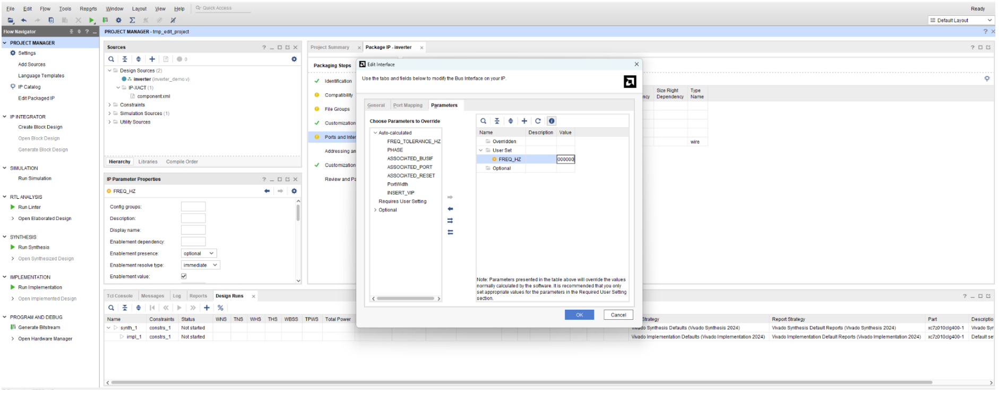

5. Add another parameter:
   - Name: `ASSOCIATED_BUSIF`
   - Value: `m_axis:s_axis`
6. Click **OK**

---

## Step 6: Package IP

1. Select **Review and Package**
2. Click **Package IP**

---

# Part 2: Top-Level Vivado Design (DMA + Zynq)

---

## Step 7: Create Top-Level Project

1. Create Project
2. Name: `top_level_inverter_demo`
3. RTL Project
4. Select Zybo Z7 board
5. Finish

---

## Step 8: Create Block Design

1. Click **Create Block Design**
2. In the diagram, click **+**
3. Add **ZYNQ7 Processing System**
4. A green banner appears → select **Run Block Automation**
5. Click **OK**

### Add DMA:

1. Click **+**
2. Add **AXI Direct Memory Access**
3. Run **Connection Automation**
4. Click **OK**

### Add custom IP:

1. Go to **Tools → Settings → IP → Repository**
2. Click **+**
3. Add the folder containing your inverter IP
4. Click **Apply → OK**

Now:
1. Click **+**
2. Add **inverter_v1_0**

### Connections:

- `s_axis` ← `M_AXIS_MM2S` (DMA)
- `m_axis` → `S_AXIS_S2MM` (DMA)
- `axi_clk` ← `FCLK_CLK0`
- `axi_reset_n` ← `FCLK_RESET0_N`

### Enable HP port:

1. Double-click **ZYNQ7 Processing System**
2. Go to **PS-PL Configuration**
3. Enable **S AXI HP0**

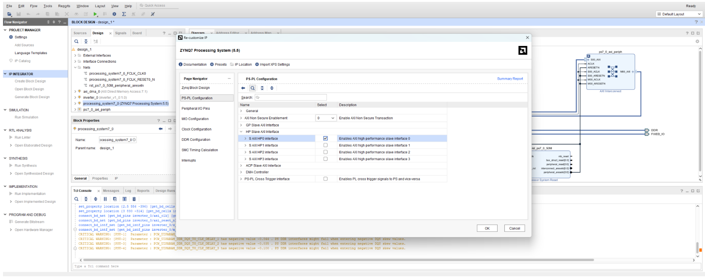

Run **Connection Automation** when prompted.

---

## Step 9: Configure DMA

1. Double-click **AXI DMA**
2. Disable **Scatter Gather Engine**
3. Set **Buffer Length Register Width** to `26`
4. Click **OK**

---

## Step 10: Generate Bitstream

1. Sources → right-click block design → **Create HDL Wrapper**
2. Select **Generate Bitstream**
3. Save
4. Launch synthesis & implementation
5. When done, view reports

### Export hardware:

1. **File → Export → Export Hardware**
2. Click **Next**
3. Select **Include Bitstream**
4. Name: `inverter_top_level_demo`
5. Click **Finish**

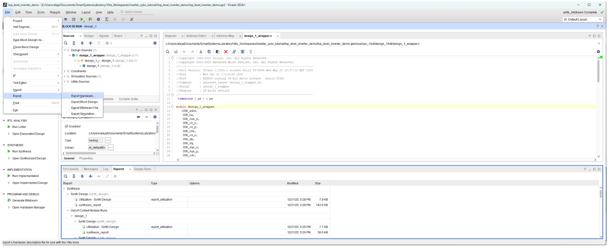

---

# Part 3: Vitis Software

---

## Step 11: Create Platform

1. Launch Vitis
2. Select **Open Workspace**
3. Choose a short path
4. Click **Select Folder**

### Create platform:

1. **Create Platform Component**
2. Leave name as `platform`
3. Select the exported `.xsa`
4. Click **Next → Next → Finish**

### Build platform:

1. Select `platform`
2. Click **Build**

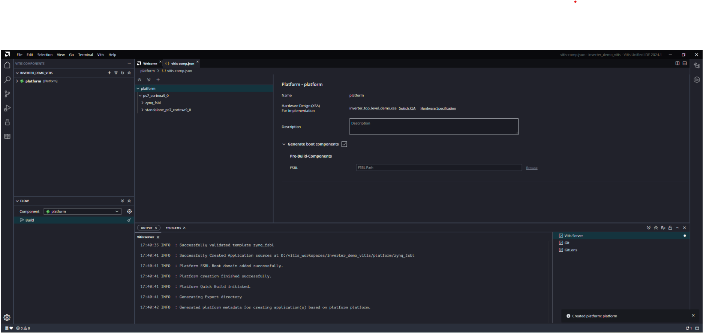

---

## Step 12: Create Software Application

1. **File → New Component → From Examples**
2. Select **Hello World**
3. Name: `software`
4. Select your platform
5. Finish

Open:
- `software → src → helloworld.c`
- Replace the file with your provided code in the sw folder named main.c

Build the software component.

---

# Part 4: Python Test

---

## Step 13: Python Script

1. Open VS Code / PyCharm
2. Create `test.py` 
3. Paste the provided Python code (in sw folder)

---

## Step 14: Run the System

### Program FPGA from Vitis

In Python terminal:

```bash
python test.py gengar.jpg
```

*(Replace `gengar.jpg` with any image you want)*

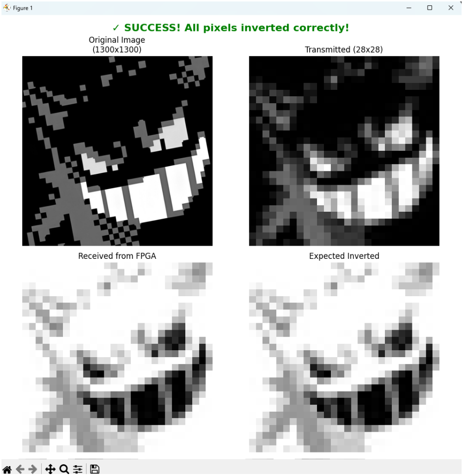

---

## Result

1. Image is streamed via UART
2. DMA sends data through custom AXI-Stream inverter
3. FPGA returns inverted image
4. Python verifies correctness and displays output

---
